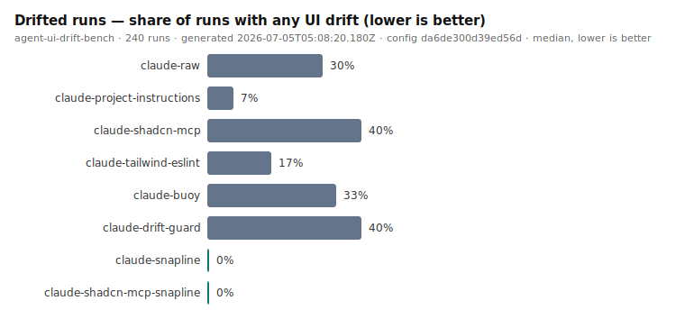
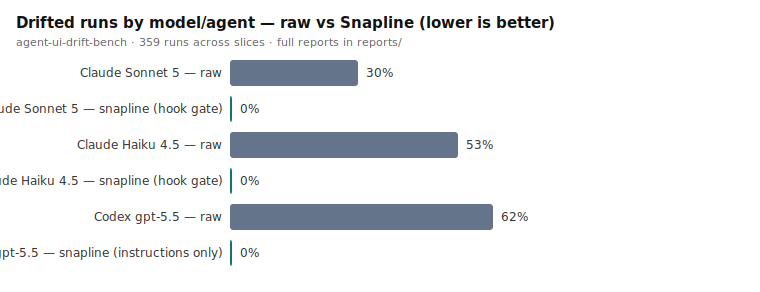

<p align="center">
  
</p>

<p align="center">
   Keep AI-generated UI on-system.
</p>

<p align="center">
  <a href="https://github.com/gael55x/Snapline/blob/main/docs/README.md"><strong>Documentation</strong></a>
  ·
  <a href="https://github.com/gael55x/Snapline/blob/main/docs/architecture.md"><strong>Architecture</strong></a>
  ·
  <a href="https://github.com/gael55x/Snapline/blob/main/docs/benchmark.md"><strong>Benchmark</strong></a>
  ·
  <a href="https://github.com/gael55x/Snapline/blob/main/docs/roadmap.md"><strong>Roadmap</strong></a>
</p>

<p align="center">
  <a href="https://github.com/gael55x/Snapline/actions/workflows/ci.yml"></a>
  
  
  
  
</p>

**Stop agents from writing rogue Tailwind.**

AI coding agents write React/Tailwind/shadcn UI that renders, looks fine, and is quietly off-system.

They inline `mt-[13px]` instead of using the scale.
They reach for `bg-blue-500` instead of `bg-primary`.
They hand-roll a `<button>` next to your `<Button>`.
They duplicate `BaseModal.tsx` while `Dialog` sits unused.
They forget your CLAUDE.md rules as the context window fills.

Snapline is not a design-system scanner you run after the damage. It is an
**agent UI repair hook**: it catches drift while the agent is still coding,
hands back an exact repair contract, and blocks completion until severe drift
is fixed. No cloud, no dashboard, no LLM in the scanner — a deterministic TSX
scanner wired into your agent's lifecycle.

## What Snapline does

Snapline sits between your coding agent and your design system.

```
you prompt the agent
  └─ agent writes/edits TSX
       └─ PostToolUse hook: Snapline scans the changed file
            ├─ clean  → agent continues
            └─ drift  → hook blocks with a repair contract → agent fixes itself
  └─ agent tries to finish
       └─ Stop hook: Snapline scans the changed set
            ├─ clean  → done
            └─ severe drift → agent cannot finish yet
```

It helps the agent answer three questions after every edit:

1. **Is this UI on-system?**
2. **If not, what exactly do I change?**
3. **Am I allowed to finish yet?**

The repair contract is exact, not vibes:

```
SNAPLINE FOUND UI DRIFT

src/app/settings/billing/page.tsx

4 violations:
- [warn]  raw Tailwind color: bg-blue-500 (line 10)
- [error] arbitrary value: mt-[13px] (line 8)
- [error] raw <button> used while <Button> exists (line 15)
- [error] arbitrary value: rounded-[11px] (line 8)

Repair:
- Replace mt-[13px] with mt-3 (12px) if the value is still needed — arbitrary values bypass the design scale.
- Replace rounded-[11px] with rounded-xl (12px) if the value is still needed — arbitrary values bypass the design scale.
- Import Button from "@/components/ui/button" and replace the raw <button> with <Button>. Use variant props (variant="default" | "outline" | "ghost" | "destructive") instead of color classes.

Recommended:
- Replace bg-blue-500 with bg-primary.
```

## Install

Requirements:

- Node.js 20 or newer
- A React/Tailwind project (shadcn/ui gets the most out of the component rules)
- Git (for `scan --changed` and the Stop gate)

```sh
npm i -D @usesnapline/cli
```

> Install before running `npx snapline`: without a local install, npx fetches an
> unrelated legacy package that happens to own the bare `snapline` name.

## Quick start

1. Initialize: `npx snapline init` — detects Next.js/Tailwind/shadcn and writes `snapline.yml`
2. Wire the hooks: `npx snapline install claude` — adds PostToolUse + Stop to `.claude/settings.json`
3. Prompt your agent as usual. Drift gets repaired before the agent can finish.

Or install as a Claude Code plugin:

```
/plugin marketplace add gael55x/Snapline
/plugin install snapline
```

Verify the setup:

```sh
npx snapline doctor
```

Full walkthrough: [Quickstart](docs/quickstart.md).

## Use it manually

```sh
npx snapline scan              # scan the project (exit 1 on errors — CI-friendly)
npx snapline scan --changed    # only git-changed files
npx snapline score             # drift score + component reuse rate
npx snapline fix --safe        # apply mechanical fixes only
```

## Rules (v1)

| rule                     | catches                                           | default |
| ------------------------ | ------------------------------------------------- | ------- |
| no-raw-hex               | `text-[#6366f1]`, `style={{ color: "#6366f1" }}`  | error   |
| no-inline-style          | `style={{ marginTop: "13px" }}`                   | error   |
| no-arbitrary-tailwind    | `mt-[13px]`, `w-[472px]`, `text-[14px]`           | error   |
| no-raw-palette-color     | `bg-blue-500`, `text-gray-500`, `border-zinc-200` | warn    |
| require-button-component | raw `<button>` while `<Button>` exists            | error   |
| require-input-component  | raw `<input>` while `<Input>` exists              | error   |
| require-dialog-component | `role="dialog"`, fixed-inset overlays             | warn    |
| require-card-component   | repeated hand-rolled card containers              | warn    |
| no-duplicate-components  | `CustomButton.tsx`, `BaseModal.tsx`               | warn    |

Errors are high-confidence by design; heuristics only ever warn. Full details
and false-positive policy: [Rules](docs/rules.md).

## Benchmark

agent-ui-drift-bench: 240 live Claude Code sessions — 8 modes × 10 prompts ×
3 attempts, pristine checkout per run, hint-free prompts, deterministic
scoring, every raw artifact kept. **Model: `claude-sonnet-5`** (agent: Claude
Code CLI, `acceptEdits`). Full methodology: [Benchmark](docs/benchmark.md).



| mode | drifted runs | worst drift | median wall time |
|---|---|---|---|
| shadcn MCP only | 40% (12/30) | 32 | 208s |
| driftguard | 40% (12/30) | 48 | 239s |
| Buoy | 33% (10/30) | 10 | 192s |
| raw Claude | 30% (9/30) | 20 | 217s |
| eslint-plugin-tailwindcss | 17% (5/30) | 8 | 255s |
| CLAUDE.md instructions | 7% (2/30) | 10 | 171s |
| **Snapline** | **0% (0/30)** | **0** | 249s |
| **shadcn MCP + Snapline** | **0% (0/30)** | **0** | 287s |

Read it fairly: median drift is 0 for *every* mode — a frontier model stays
on-system most of the time. The difference is the tail: advisory setups leak
in 7–40% of runs; the gate leaked in none of 60. Instructions genuinely help
(30%→7%); on-demand checkers barely beat raw — a check the agent may skip is
advice. The cost is real too: the repair loop adds ~15% wall time over raw.
And one caveat we state before anyone else does: the scorer is Snapline's own,
so the meaningful claim is not "Snapline scores 0 on its own metric" but that
agents **converge** — they repair to zero in-session instead of looping or
shipping broken code (build pass held across all 60 gated runs) — while
nothing else prevents what this metric measures. Every diff is published;
re-score them with your own tool.



**Cross-model slice — `claude-haiku-4-5-20251001`** (60 runs, raw vs gated,
same prompts): weaker models drift far harder, and the gate matters far more.
Raw Haiku drifted in **53% of runs (16/30)** with a worst drift score of
**444** (22× Sonnet's worst) and a nonzero *median*. Gated Haiku: **0/30** —
and here the hooks visibly earned it: 13 PostToolUse blocks across 8 runs,
each repaired to zero in-session. Report:
[reports/latest-haiku.md](benchmarks/agent-ui-drift-bench/reports/latest-haiku.md).
**Cross-agent slice — Codex CLI, `gpt-5.5`** (44 valid runs; 15 cells failed
on account quota/timeouts, recorded with reasons and pending their retry —
never dropped): raw Codex drifted in **62% of runs (16/26)** with a nonzero
median (16). With Snapline in **instruction-level mode** — AGENTS.md +
scan-before-finish, *no hook gate exists for Codex yet* — it went **0/18**.
That isolates the repair-contract format itself: exact, machine-followable
violations converge an agent even without enforcement. Report:
[reports/latest-codex.md](benchmarks/agent-ui-drift-bench/reports/latest-codex.md).

## Status

| surface     | state                                                                             |
| ----------- | --------------------------------------------------------------------------------- |
| Claude Code | supported — hooks + plugin                                                        |
| Codex       | beta — instruction-level; hook adapter ready for when Codex ships lifecycle hooks |
| Cursor      | experimental — project rules only                                                 |
| Scanner     | deterministic, TypeScript compiler API, no LLM, no network                        |

## Documentation

Start at the [documentation index](docs/README.md).

[Introduction](docs/introduction.md) · [Why](docs/why.md) ·
[Quickstart](docs/quickstart.md) · [Mental model](docs/mental-model.md) ·
[Architecture](docs/architecture.md) · [Hooks](docs/hooks.md) ·
[Rules](docs/rules.md) · [Config](docs/config.md) ·
[Repair contracts](docs/repair-contracts.md) · [Claude](docs/claude.md) ·
[Codex](docs/codex.md) · [Cursor](docs/cursor.md) ·
[Benchmark](docs/benchmark.md) · [Competitors](docs/competitors.md) ·
[Roadmap](docs/roadmap.md) · [Release 1.0](docs/release-1.0.md)

## License

MIT
